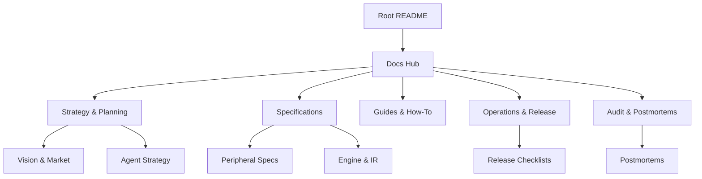

# LabWired Platform Documentation Hub

Welcome to the central documentation repository for LabWired.

If you are trying to use the product, start with the user-facing guides first. Strategy, vision, and audit material remain here, but they are secondary to the install -> run -> debug -> CI workflow.

## Start Here

- **[Root README](../README.md)** - product overview and repo entrypoint.
- **[Development Guide](../DEVELOPMENT.md)** - local setup and build/test commands.
- **[User Launch Worklist](./launch/USER_LAUNCH_WORKLIST.md)** - what must be true for a user-ready launch.
- **[Compatibility Matrix](./specs/compatibility_matrix.md)** - current support boundaries and recommended starting targets.

## 🗺️ Documentation Map

---

## 🚀 User Guides
*Use these first if you want to run or evaluate LabWired.*
- **[Development Guide](../DEVELOPMENT.md)** - setup, build, test, and common commands.
- **[Getting Started](./tutorials/getting-started.md)** - install, run your first simulation, inspect results, debug in VS Code.
- **[CI Integration](./tutorials/ci-integration.md)** - GitHub Actions, GitLab CI, and Docker recipes for firmware testing.
- **[Compatibility Matrix](./specs/compatibility_matrix.md)** - supported targets and known limits.
- **[Release Checklist](./ops/RELEASE_CHECKLIST.md)** - release-grade validation requirements.

## 🧭 [Strategy & Planning](./strategy/)
*Why the platform exists and where it is going.*
- **[Implementation Plan](./strategy/plan.md)** - Overall platform roadmap and milestones.
- **[Agent-First Platform](./strategy/agent/README.md)** - Vision for the AI-first simulation layer.
- **[HIL Displacement Showcase](./strategy/HIL_DISPLACEMENT_SHOWCASE.md)** - ROI analysis and technical results.
- **[Vision Gaps](./strategy/vision/VISION_COMPLETION_GAPS.md)** - Remaining work for the Agent-First vision.
- **[Vision Scoreboard](./strategy/vision/SCOREBOARD.md)** - Item-by-item progress tracker for all 6 gaps.

## 🛠️ [Specifications](./specs/)
*Technical definitions and product contracts.*
- **[Digital Twin Spec](./specs/DIGITAL_TWIN_SPEC.md)** - Core simulation engine requirements.
- **[Declarative Peripherals](./specs/declarative_peripherals.md)** - JSON-first peripheral modeling.
- **[Compatibility Matrix](./specs/compatibility_matrix.md)** - Supported MCU/target coverage.

## 📖 [Guides & How-To](./guides/)
*Procedural documentation for developers and evaluators.*
- **[Real HAL Guide](./guides/REAL_HAL_GUIDE.md)** - Bridging simulation to physical hardware.
- **[NUCLEO-H563ZI Demo](./guides/NUCLEO_H563ZI_DEMO.md)** - Live showcase script and narration.
- **[Video Runbook](./guides/NUCLEO_H563ZI_VIDEO_RUNBOOK.md)** - Recording procedures.
- **[Safety Guidelines](./guides/SAFETY.md)** - Operational safety for hardware simulation.

## ⚙️ [Operations & Release](./ops/)
*Release gates and operating runbooks.*
- **[Release Checklist](./ops/RELEASE_CHECKLIST.md)** - Platform-level quality gates.
- **[Demo Dry Run](./ops/DEMO_DRY_RUN.md)** - Checklist for external demos.
- **[VS Code UI Checklist](./ops/VS_CODE_UI_DEMO_CHECKLIST.md)** - Manual UI validation steps.
- **[Foundry Decommission Runbook](./ops/FOUNDRY_DECOMMISSION.md)** - Manual steps for retiring the legacy Foundry stack (Stripe, Hetzner, DNS).

## 📊 [Audit & Postmortems](./audit/)
*Historical records and incident analyses. Useful for contributors, not the first stop for users.*
- **[Postmortems](./audit/postmortems/README.md)** - Incident analysis and prevention.
- **[Optimization Audit](./audit/REFACTOR_OPTIMIZATION_AUDIT_2026-02-13.md)** - Runtime code health findings.
- **[Practical Test Evaluation](./audit/PRACTICAL_TEST_EVALUATION.md)** - Performance and accuracy benchmarks.

---

## 🧩 External Components
For module-specific details, see:
- **[Core Emulator Engine](../core/README.md)**
- **[VS Code Extension](../vscode/README.md)**
- **[AI Transition Tools](../ai/README.md)**

---
[← Back to Root](../README.md)
