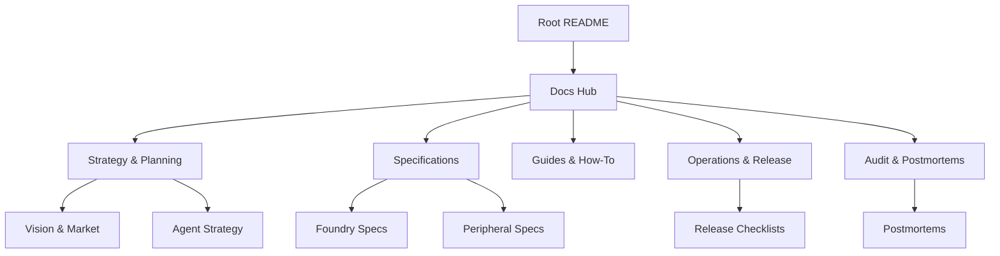

# LabWired Platform Documentation Hub

Welcome to the central documentation repository for the LabWired platform. This hub organizes strategy, specifications, guides, and operational records for the entire monorepo.

## 🗺️ Documentation Map

---

## 🚀 [Strategy & Planning](./strategy/)
*The "Why" and "Where" of the LabWired platform.*
- **[Implementation Plan](./strategy/plan.md)** - Overall platform roadmap and milestones.
- **[Agent-First Platform](./strategy/agent/README.md)** - Vision for the AI-first simulation layer.
- **[HIL Displacement Showcase](./strategy/HIL_DISPLACEMENT_SHOWCASE.md)** - ROI analysis and technical results.
- **[Vision Gaps](./strategy/vision/VISION_COMPLETION_GAPS.md)** - Remaining work for the Agent-First vision.

## 🛠️ [Specifications](./specs/)
*The technical definitions and architectural specs.*
- **[Digital Twin Spec](./specs/DIGITAL_TWIN_SPEC.md)** - Core simulation engine requirements.
- **[Foundry Product Spec](./specs/FOUNDRY_SPEC.md)** - Dashboard and API surface definitions.
- **[Declarative Peripherals](./specs/declarative_peripherals.md)** - JSON-first peripheral modeling.
- **[Compatibility Matrix](./specs/compatibility_matrix.md)** - Supported MCU/target coverage.

## 📖 [Guides & How-To](./guides/)
*Procedural documentation for developers and users.*
- **[Real HAL Guide](./guides/REAL_HAL_GUIDE.md)** - Bridging simulation to physical hardware.
- **[NUCLEO-H563ZI Demo](./guides/NUCLEO_H563ZI_DEMO.md)** - Live showcase script and narration.
- **[Video Runbook](./guides/NUCLEO_H563ZI_VIDEO_RUNBOOK.md)** - Recording procedures.
- **[Safety Guidelines](./guides/SAFETY.md)** - Operational safety for hardware simulation.

## ⚙️ [Operations & Release](./ops/)
*Gatekeeping and runbooks for stable delivery.*
- **[Release Checklist](./ops/RELEASE_CHECKLIST.md)** - Platform-level quality gates.
- **[Foundry Production Checklist](./ops/FOUNDRY_PRODUCTION_CHECKLIST.md)** - First-production deployment and cutover gates for Foundry.
- **[Demo Dry Run](./ops/DEMO_DRY_RUN.md)** - Checklist for external demos.
- **[VS Code UI Checklist](./ops/VS_CODE_UI_DEMO_CHECKLIST.md)** - Manual UI validation steps.

## 📊 [Audit & Postmortems](./audit/)
*Historical records and incident analyses.*
- **[Postmortems](./audit/postmortems/README.md)** - Incident analysis and prevention.
- **[Optimization Audit](./audit/REFACTOR_OPTIMIZATION_AUDIT_2026-02-13.md)** - Runtime code health findings.
- **[Practical Test Evaluation](./audit/PRACTICAL_TEST_EVALUATION.md)** - Performance and accuracy benchmarks.

---

## 🧩 External Components
For technical details on specific modules, see:
- **[Core Emulator Engine](../core/README.md)**
- **[VS Code Extension](../vscode/README.md)**
- **[AI Transition Tools](../ai/README.md)**

---
[← Back to Root](../README.md)
