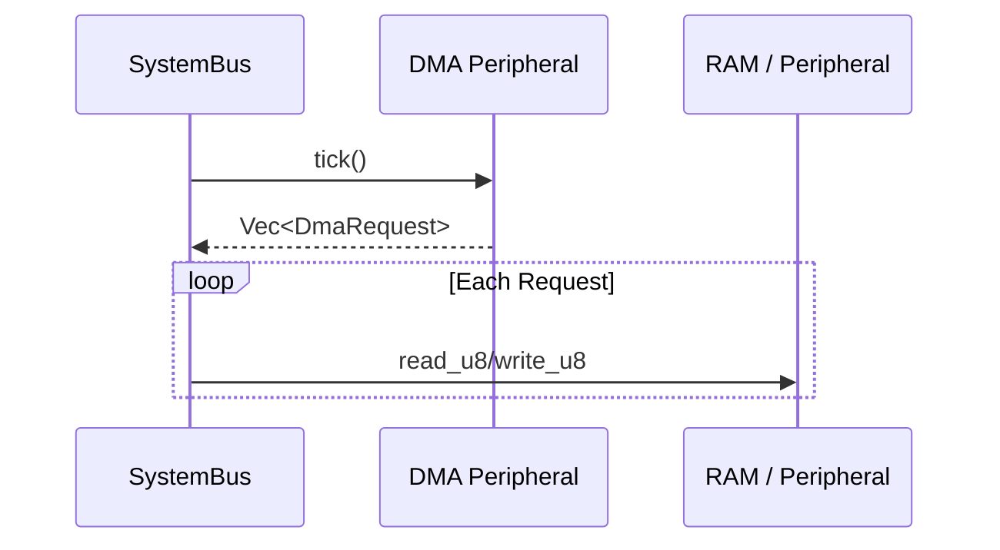

# Advanced STM32 Peripherals Design

This document describes the architectural approach for supporting complex STM32 systems in LabWired, focusing on **DMA**, **EXTI**, and **AFIO**.

## Direct Memory Access (DMA)

LabWired implements DMA using a **two-phase request/execute model** to maintain architectural modularity and comply with Rust's ownership rules.

### Design Principles
1.  **Decoupling**: The DMA controller is a standard `Peripheral`. It doesn't have direct access to the `SystemBus` to avoid circular dependencies.
2.  **Request-Based Mastering**: During its `tick()`, a peripheral (like DMA) returns a list of `DmaRequest` objects.
3.  **Bus Execution**: The `SystemBus` executes these requests after the peripheral tick phase, effectively acting as the "arbiter".

### Execution Flow
1.  **Phase 1: Tick**: `SystemBus` calls `tick()` on all peripherals.
2.  **Phase 2: Collect**: `SystemBus` aggregates all `DmaRequest`s returned by peripherals.
3.  **Phase 3: Execute**: `SystemBus` performs the memory operations (Read/Write) requested by the DMA.

## External Interrupts (EXTI) & AFIO

EXTI and AFIO work together to map GPIO signals to processor interrupts.

### EXTI Mapping
EXTI handles 16 lines corresponding to GPIO pins 0-15.
-   Line 0: GPIOA pin 0, GPIOB pin 0, etc. (selected via AFIO)
-   Lines 16-19: Specific events (PVD, RTC, USB, etc.)

### Implementation Strategy
1.  **Signal Propagation**: Peripherals can now emit signals or trigger other peripherals via a `SignalBus` (future enhancement) or direct wiring in `SystemBus`.
2.  **Configurable Mapping**: AFIO registers define which GPIO port maps to which EXTI line.

## Current Support Status

| Feature | Status | Notes |
| :--- | :--- | :--- |
| DMA Mastering | [x] Implemented | Two-phase execution in `SystemBus`. |
| EXTI Controller | [ ] Planned | Standard STM32F103 mapping. |
| AFIO Remapping | [ ] Planned | Basic pin mapping support. |
