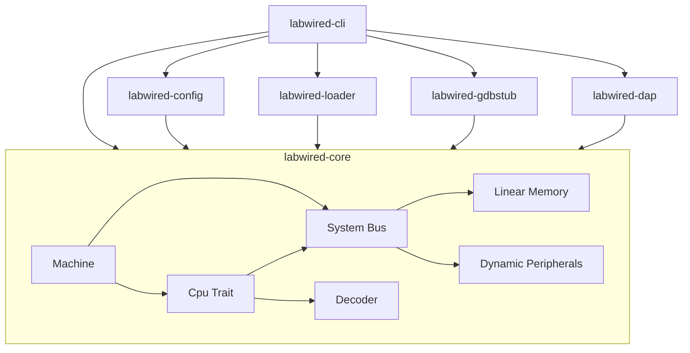

# LabWired Architecture

## High-Level Overview

The system is designed as a set of decoupled Rust crates to ensure portability and separation of concerns.



## Component Definitions

### 1. `labwired-core`
The execution engine. Designed to be `no_std` compatible and **architecture-agnostic**.

#### **Pluggable Core Pattern**
The `Machine` struct is generic over the `Cpu` trait (`Machine<C: Cpu>`). This allows swapping the execution core (e.g., specific Cortex-M variants, RISC-V, etc.) without changing the bus or memory infrastructure.
The `Cpu` trait defines the minimal interface:
```rust
trait Cpu {
    fn reset(&mut self, bus: &mut dyn Bus) -> SimResult<()>;
    fn step(&mut self, bus: &mut dyn Bus, observers: &[Arc<dyn SimulationObserver>]) -> SimResult<()>;
    // ... Debug accessors ...
}
```

The system currently supports:
- **Arm (Cortex-M)**: Via `CortexM` struct.
- **RISC-V**: Via `RiscV` struct (initial support).

#### **Memory Model**

#### **Dynamic Bus & Peripherals**
The system uses a `SystemBus` that routes memory accesses dynamically based on a project manifest.
- **Flash Memory**: Base address varies by chip. Loads ELF segments.
- **RAM**: Base address varies by chip. Supports read/write.
- **Peripherals**: Memory-mapped devices (UART, SysTick, Stubs) mapped to arbitrary address ranges.

Peripherals are integrated via the `Peripheral` trait:
```rust
pub trait Peripheral: std::fmt::Debug + Send {
    fn read(&self, offset: u64) -> SimResult<u8>;
    fn write(&mut self, offset: u64, value: u8) -> SimResult<()>;
    fn tick(&mut self) -> PeripheralTickResult; // Returns IRQ status, cycles, and DMA requests
    fn snapshot(&self) -> serde_json::Value;
}
```

#### **Debug Support**
The core exposes a `DebugControl` trait implemented by `Machine`, allowing external tools (like GDB or DAP) to:
- Read/Write Core Registers.
- Read/Write Memory.
- Set/Clear Breakpoints.
- Single Step or Run (with stop reasons).

#### **Decoder (Thumb-2)**
A stateless module confirming to ARMv7-M Thumb-2 encoding.
**Supported Instructions**:
- **Control Flow**: `B <offset>`, `Bcc <cond, offset>`, `BL` (32-bit), `BX`, `CBZ`, `CBNZ`.
- **Arithmetic**: `ADD`, `SUB`, `CMP`, `MOV`, `MVN`, `MOVW` (32-bit), `MOVT` (32-bit), `MUL`.
    - **Wide (32-bit) Variants**: `ADD.W`, `SUB.W`, `ADC.W`, `SBC.W`, `MOV.W`, `MVN.W`, `BIC.W`, `ORN.W`.
    - **Shifted Register Variants**: Support for 32-bit forms with arbitrary barrel shifter offsets.
    - **Division**: `SDIV`, `UDIV` (32-bit encoding).
    - Includes **High Register** support for `MOV`, `CMP`, and `ADD`.
    - Dedicated `ADD SP, #imm` and `SUB SP, #imm` forms.
- **Logic**: `AND`, `ORR`, `EOR`.
- **Shifts**: `LSL`, `LSR`, `ASR`, `ROR` (Immediate and Register-modified).
- **Bit Field & Misc**: `BFI`, `BFC`, `SBFX`, `UBFX`, `CLZ`, `RBIT`, `REV`, `REV16`, `UXTB`.
- **Memory**:
    - `LDR`/`STR` (Immediate Offset / Word)
    - `LDRB`/`STRB` (Immediate Offset / Byte)
    - `LDRH`/`STRH` (Immediate Offset / Halfword)
    - `LDR` (Literal / PC-Relative)
    - `LDR`/`STR` (SP-Relative)
    - `LDRD`/`STRD` (Double Word - minimal support)
    - `PUSH`/`POP` (Stack Operations)
- **Interrupt Control**: `CPSIE`, `CPSID` (affecting `primask`).
- **Other**: `NOP`, `IT` block (treated as NOP hints for robustness).

#### **Core Peripherals (STM32F1 Compatible)**
The system includes a suite of memory-mapped peripherals to support real-world HAL libraries:
- **GPIO**: Mode configuration (CRL/CRH), Pin state tracking (IDR/ODR), and atomic bit manipulation (BSRR/BRR).
- **RCC**: Reset and Clock Control (minimal) for peripheral enablement.
- **Timers**: TIM2/TIM3 general-purpose timers with prescaling and update interrupts.
- **I2C**: I2C Master mode with status flag sequence support (Start, Address, Transmit).
- **SPI**: SPI Master mode with basic full-duplex transfer mocking.
- **SysTick**: Standard Cortex-M system timer.
- **NVIC**: Nested Vectored Interrupt Controller with prioritization and masking.
- **SCB**: System Control Block with VTOR support.
- **DMA1**: 7-channel Direct Memory Access controller with bus mastering support.
- **EXTI**: External Interrupt/Event Controller for handling external signals.
- **AFIO**: Alternate Function I/O for dynamic pin-to-interrupt mapping.

### DMA Mastering (Two-Phase Execution)
To maintain modularity and comply with Rust's ownership rules, LabWired uses a two-phase execution model for DMA:
1.  **Phase 1 (Request)**: During `tick()`, a peripheral returns a list of `DmaRequest`s.
2.  **Phase 2 (Execute)**: The `SystemBus` iterates over these requests and performs the corresponding memory operations.

#### **32-bit Reassembly**
The CPU supports robust reassembly of 32-bit Thumb-2 instructions (`BL`, `MOVW`, `MOVT`, `MOV.W`, `MVN.W`, `SDIV`, `UDIV`) by fetching the suffix half-word during the execution of a `Prefix32` opcode.

### 2. `labwired-config`
Handles hardware declaration, validation, and test scripting.
- **Chips**: `ChipDescriptor` defines memory map (Flash/RAM) and peripheral base addresses.
- **System**: `SystemManifest` defines the board-level configuration (chip selection, external devices).
- **Peripherals**: `PeripheralDescriptor` defines register maps, fields, and side-effects.
- **Tests**: `TestScript` (v1.0) defines automated test scenarios with:
    - Inputs (firmware, system config)
    - Limits (steps, cycles, wall time)
    - Assertions (UART output regex, expected stop reason)

### 3. `labwired-loader`
Handles binary parsing.
- Uses `goblin` to parse ELF files.
- Extracts `PT_LOAD` segments.
- Produces a `ProgramImage` containing segments and the Entry Point.

### 4. `labwired-cli`
The host runner and entry point.
- **Initialization**: Parses arguments and loads configuration.
- **Configuration**: Resolves Chip Descriptors and wiring via `labwired-config`.
- **Loading**: Loads ELF segments into the dynamically configured `SystemBus`.
- **Modes**:
    - **Run**: continuous execution.
    - **Debug**: Starts GDB server or DAP server.
    - **Test**: Runs automated test scripts.

### 5. `labwired-gdbstub`
Implements the GDB Remote Serial Protocol (RSP) to allow debugging LabWired from GDB.
- Wraps `Machine` in a `LabwiredTarget`.
- Implements `gdbstub::Target` traits for single-step, breakpoints, and register/memory access.
- Supports both Arm and RISC-V architectures.

### 6. `labwired-dap`
Implements the Debug Adapter Protocol (DAP) to allow debugging LabWired directly from VS Code.
- Provides a DAP server that communicates with the IDE.
- Controls the `Machine` execution.
- **Custom Telemetry Protocol**: Streams high-frequency simulation metrics without interfering with standard DAP request/response cycles.

#### **Telemetry Event Specification**
The server emits a custom `telemetry` event every 100ms during execution:
```json
{
  "type": "event",
  "event": "telemetry",
  "body": {
    "pc": 134218240,
    "cycles": 1204500,
    "mips": 42.5,
    "registers": {
      "R0": 0,
      "R15": 134218240,
      "...": 0
    }
  }
}
```
- **`pc`**: Current Program Counter.
- **`cycles`**: Total cumulative simulation cycles.
- **`mips`**: Calculated Millions of Instructions Per Second based on the 100ms delta.
- **`registers`**: Map of register names to their current 32nd-bit unsigned values.
