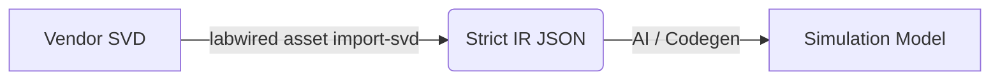

# Asset Foundry: SVD Ingestion & Strict IR

The **Asset Foundry** is LabWired's pipeline for transforming vendor-specific hardware descriptions (SVDs) into a unified, AI-ready format called **Strict IR**.

## Overview



## Strict IR (`labwired-ir`)

Vendor SVD files are notoriously inconsistent. They use:
-   **Register Arrays**: `UART0`, `UART1`... vs `UART[0]`, `UART[1]`.
-   **Clusters**: Nested structs of registers.
-   **Inheritance**: `derivedFrom` attributes that require complex resolution.

The **Strict IR** removes all this complexity.
-   **Flat**: No clusters or inheritance. Just a list of peripherals.
-   **Explicit**: All arrays are unrolled. `UART[0]` becomes a distinct entries with absolute addresses.
-   **Portable**: Serialized to stable JSON.

### Key Structures
-   `IrDevice`: Root object.
-   `IrPeripheral`: A single hardware block (e.g., `USART1`) with a base address and list of registers.
-   `IrRegister`: A register at an absolute offset.

## CLI Usage

The `labwired` CLI is used to perform the ingestion.

### Command
```bash
labwired asset import-svd --input <INPUT_SVD> --output <OUTPUT_JSON>
```

### Example
```bash
# Ingest STM32F103 SVD
labwired asset import-svd \
  --input vendor_svds/STM32F103.svd \
  --output models/stm32f103.json
```

## Verification
The pipeline is verified against the `advanced_stm32.svd` fixture, which contains:
-   Recursive `derivedFrom`.
-   Register Arrays (`dim` element).
-   Register Clusters.

Run the tests to verify compliance:
```bash
cargo test -p labwired-ir --features svd
cargo test -p labwired-cli --test asset_import
```

---

## See Also
- [Foundry Pricing Model](./spec/FOUNDRY_PRICING.md)
- [Simulation Protocol](../core/docs/simulation_protocol.md)
- [High-Fidelity Verification Case Study](../core/docs/verification_lessons_adxl345.md)
