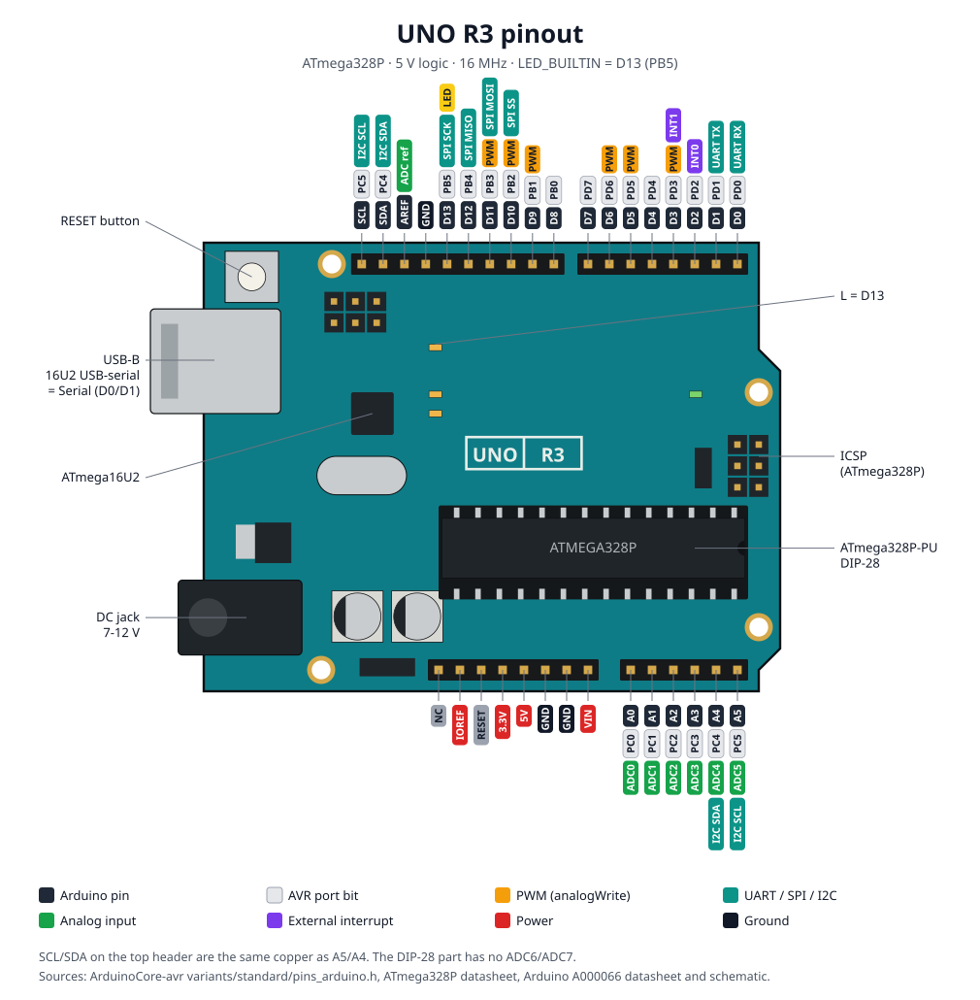

# Arduino Uno R3

The classic 5 V board (A000066): **ATmega328P** at 16 MHz, 32 KB flash, 2 KB SRAM,
an **ATmega16U2** USB-serial bridge on the USB-B port, and the shield headers every
other board copies. On LabWired the Uno runs real Arduino-core firmware on the AVR8
interpreter, with all three I/O ports, USART0, SPI, I2C and the ADC reaching the
canvas.

!!! tip "Live status"
    The tables below are a maintained snapshot. Authoritative automation:

    - [Chip conformance scoreboard](../coverage/chip-conformance.md)
    - [Target support rubric](../target_support_rubric.md)

[](../assets/boards/arduino-uno/board.svg)

---

## Status at a glance

| Aspect | Status |
|--------|--------|
| Chip descriptor | [`configs/chips/atmega328p.yaml`](../../configs/chips/atmega328p.yaml) |
| System YAML | [`configs/systems/arduino-uno.yaml`](../../configs/systems/arduino-uno.yaml) |
| Examples | [`examples/arduino-uno-blinky/`](../../examples/arduino-uno-blinky/README.md) (smoke) · [`examples/arduino-uno-io/`](../../examples/arduino-uno-io/README.md) (every port) |
| Playground board id | `arduino-uno` |
| Hosted compile | Arduino (PlatformIO `uno`) and Rust (`avr-none`, `atmega328p`) |
| Tier (snapshot) | L1 smoke. Datasheet-derived. **No silicon capture yet.** |

The Nano ([`configs/systems/arduino-nano.yaml`](../../configs/systems/arduino-nano.yaml)) is the same chip in the TQFP package, which adds ADC6/ADC7. Everything on this page applies to it except the header layout.

---

## Flash / firmware artifact

| Use | Artifact | Notes |
|-----|----------|-------|
| Twin / CLI | **ELF** from avr-gcc | Loaded at flash address 0. No bootloader runs. |
| Bench | **HEX** through the Optiboot bootloader | `avrdude -c arduino -p m328p -b 115200 -P <port> -U flash:w:firmware.hex` |
| Playground | Hosted compile, board `arduino-uno` | Browser flashing to a physical Uno is not wired. |

---

## Twin vs USB cable

On the Uno the USB-B cable is not native USB. The 16U2 bridges it to **USART0** on D0/D1,
so the serial pane and the Serial Monitor carry the same bytes.

| | Twin | USB-B cable |
|---|---|---|
| Console | USART0 TX, captured as the serial pane | 16U2 USB CDC, same USART0 bytes |
| LED `L` | `board_io` LED on PB5 (D13) | Yellow LED on D13 |
| Load | ELF at address 0 | HEX over Optiboot at 115200 baud |

---

## Pins

[](../assets/boards/arduino-uno/pinout.svg)

Open the pinout full size to read the tags.

Header silk and functions from `ArduinoCore-avr` `variants/standard/pins_arduino.h`
and the ATmega328P datasheet.

### Digital header (top, left to right)

| Silk | Arduino | AVR | Functions |
|------|---------|-----|-----------|
| (none) | SCL | PC5 | I2C SCL. Same copper as A5. |
| (none) | SDA | PC4 | I2C SDA. Same copper as A4. |
| AREF | AREF | — | ADC external reference |
| GND | GND | — | |
| 13 | D13 | PB5 | SPI SCK, LED `L` |
| 12 | D12 | PB4 | SPI MISO |
| ~11 | D11 | PB3 | PWM (OC2A), SPI MOSI |
| ~10 | D10 | PB2 | PWM (OC1B), SPI SS |
| ~9 | D9 | PB1 | PWM (OC1A) |
| 8 | D8 | PB0 | |
| 7 | D7 | PD7 | |
| ~6 | D6 | PD6 | PWM (OC0A) |
| ~5 | D5 | PD5 | PWM (OC0B) |
| 4 | D4 | PD4 | |
| ~3 | D3 | PD3 | PWM (OC2B), INT1 |
| 2 | D2 | PD2 | INT0 |
| TX→1 | D1 | PD1 | USART0 TX |
| RX←0 | D0 | PD0 | USART0 RX |

### Power and analog headers (bottom, left to right)

| Silk | Arduino | AVR | Functions |
|------|---------|-----|-----------|
| (none) | NC | — | Not connected |
| IOREF | IOREF | — | 5 V I/O reference for shields |
| RESET | RESET | PC6 | Active-low reset |
| 3.3V | 3V3 | — | 3.3 V output |
| 5V | 5V | — | |
| GND | GND | — | Two pins |
| Vin | VIN | — | 7-12 V input, shared with the DC jack |
| A0 | A0 | PC0 | ADC0 |
| A1 | A1 | PC1 | ADC1 |
| A2 | A2 | PC2 | ADC2 |
| A3 | A3 | PC3 | ADC3 |
| A4 | A4 | PC4 | ADC4, I2C SDA |
| A5 | A5 | PC5 | ADC5, I2C SCL |

In the Playground, every pin in the atmega328p pin bank is a wire target: D0-D13, A0-A5,
AREF, 5V, 3V3, VIN and GND. SCL, SDA, IOREF, RESET, NC and the second GND are drawn as
sockets but carry no wire of their own.

---

## Support matrix

| Mark | Meaning |
|------|---------|
| ✅ | Modeled well enough for the demos we ship |
| ⚠️ | Present but partial, or easy to misuse |
| ❌ | Not simulated. Use the bench. |

| Block | Twin | Notes |
|-------|------|-------|
| AVR8 instruction set | ✅ | Arduino-core sketches run. An unknown opcode faults instead of being skipped. |
| Flash 32 KB / SRAM 2 KB | ✅ | |
| GPIO ports B, C, D (D0-D13, A0-A5) | ✅ | Outputs reach canvas LEDs; buttons reach `digitalRead`. |
| `INPUT_PULLUP` with nothing wired | ⚠️ | Reads LOW. A canvas button supplies the released HIGH level. |
| Timer0 overflow (`millis`, `delay`, `micros`) | ✅ | |
| Timer0 compare outputs, Timer1, Timer2 | ❌ | `analogWrite` PWM, `tone()` and the Servo library do not drive their pins. |
| USART0 TX (`Serial.print`) | ✅ | Transmit completes immediately. |
| USART0 RX (`Serial.read`) | ❌ | UDR0 always reads 0 and RXC never sets. |
| SPI master | ✅ | With devices attached from the parts catalog. |
| I2C (TWI) master | ✅ | With devices attached from the parts catalog. ACK/NACK status codes follow the datasheet. |
| SPI / I2C slave mode | ❌ | |
| ADC, channels A0-A5 | ✅ | Converts the millivolts a canvas analog part drives. Unconnected channels read 512. |
| ADC bandgap (1.1 V) and REFS | ✅ | AREF is taken as 5 V; the internal 1.1 V reference is modeled. |
| ADC conversion time | ⚠️ | A conversion completes as soon as ADSC is set. |
| ADC temperature sensor | ❌ | Reads 0. |
| External interrupts INT0/INT1, pin change | ❌ | `attachInterrupt` never fires. |
| EEPROM | ❌ | No EECR/EEDR model and no persistence. |
| Watchdog | ❌ | |
| `SLEEP` | ⚠️ | Treated as a no-op. The CPU does not stop. |
| ATmega16U2 USB bridge | ⚠️ | Not modeled as a chip. Its effect, USART0 on the cable, is what the serial pane shows. |
| Potentiometer part on a 5 V board | ⚠️ | The part model runs from a 3.3 V rail, so full travel reads about 675. Wire its top leg to 3.3V on the bench to match. |

---

## What it catches vs bench

**Sim is strong for:** sketch logic and state machines; digital I/O on every header pin;
`millis`-based timing; Serial output; SPI and I2C driver bring-up against catalog parts;
`analogRead` against a knob or sensor; deterministic CI runs.

**Still use the bench for:** PWM and `tone()`; interrupts on pins; serial input; EEPROM;
power, brown-out and analog accuracy; the bootloader and USB enumeration.

---

## How to run

### CLI (oracle / CI)

```bash
cargo run -q -p labwired-cli -- test \
  --script examples/arduino-uno-blinky/io-smoke.yaml \
  --no-uart-stdout
```

```bash
cargo run -q -p labwired-cli -- test \
  --script examples/arduino-uno-io/io-smoke.yaml \
  --no-uart-stdout
```

AVR firmware runs through its system manifest, which is what `test --script` does.

### Playground

1. Open [app.labwired.com](https://app.labwired.com).
2. Board: **Arduino Uno R3 (ATmega328P)**.
3. Write or paste a sketch, then **Run**.
4. Assert on GPIO, Serial and analog inputs, not on ❌ rows.

### Agent (MCP)

1. [Connect MCP](../agent/mcp.md).
2. `labwired_describe` → `arduino-uno` or `atmega328p`.
3. `labwired_compile` → `labwired_run` → **`labwired_verify`**.

---

## Related systems & examples

| Path | What |
|------|------|
| `configs/systems/arduino-uno.yaml` | Board manifest |
| `examples/arduino-uno-blinky` | Blink and Serial smoke, board docs pack, images |
| `examples/arduino-uno-io` | Button on D2, LED on D7, potentiometer on A0 |
| `crates/core/tests/avr_uno_io.rs` | Drives each port from outside and checks what the sketch prints |
| [Arduino Nano](../../configs/systems/arduino-nano.yaml) | Same chip, TQFP package |
