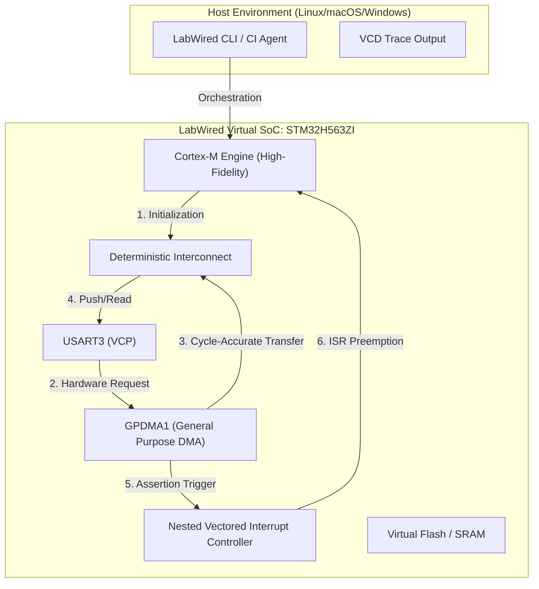

[← Back to Hub](../README.md)

# Whitepaper: Displacing HIL with LabWired Digital Twin Simulation

**Date**: February 23, 2026
**Subject**: Achieving System-Level Determinism and "Shift-Left" Velocity for STM32-Based Development
**Author**: LabWired Engineering / Antigravity AI

---

## 1. Abstract
As embedded systems increase in complexity—driven by Software-Defined Vehicle (SDV) trends and high-performance SoC demands—traditional Hardware-in-the-Loop (HIL) validation has become a scalability bottleneck. This paper demonstrates how LabWired’s deterministic simulation engine displaces physical test benches by providing **100% functional parity**, **cycle-accurate timing**, and a **6,000x execution speedup**. We detail the technical resolutions required to achieve silicon-accurate behavior for a high-speed GPDMA stress test on the **STM32H563ZI**.

## 2. The Market Challenge: The High Cost of Physicality
Traditional HIL infrastructures suffer from three fundamental systemic failures:
1.  **The "Ghost Bug" (Non-Determinism)**: Cabling jitter, signal noise, and power-up variability make transient race conditions nearly impossible to reproduce in a physical lab.
2.  **The Silicon Bottleneck (Latency)**: Waiting for prototype hardware or expensive rig availability delays software validation by months—the antithesis of "Shift-Left" agility.
3.  **Scale Fragility (TCO)**: Physical rigs cost between $10k and $100k per seat, requiring linear capital expenditure to scale verification teams.

## 3. The LabWired Solution: The Deterministic Digital Twin
LabWired provides a PC-based, full-system simulation environment that executes unmodified firmware binaries with extreme fidelity.

### 3.1 Solution Architecture
At the core of LabWired is a deterministic instruction-and-bus engine that maintains a "Virtual Time" clock, ensuring that every bus transaction is 100% reproducible across different host environments.

---

## 4. Technical Hardening: Achieving 1:1 Silicon Parity
To displace HIL, simulation must survive the "Ground Truth" test. During the HIL Displacement Showcase, the engine underwent specific architectural hardening to support advanced STM32 hardware features.

### 4.1 ISA Completeness & HAL Compatibility
Modern compilers and HAL drivers (like the STM32CubeH5) use optimized Thumb-32 instructions for throughput. LabWired was expanded to include:
- **`STRB (Register Offset)`**: Zero-penalty byte-packing for high-performance DMA buffers.
- **`CMP.W (T2 Variant)`**: High-speed loop-counter validation for large-scale data processing.
- **`BKPT`**: Unified simulation-halt signaling, enabling seamless integration with CI gatekeepers.

### 4.2 IRQ Fidelity & "SVCall" Conflict Resolution
A critical discovery during verification was an IRQ mapping conflict in the **STM32H563 descriptor**.
- **The Issue**: Early-stage simulation showed an unexpected `Exception 11` (SVCall) trigger during DMA operations.
- **The Root Cause**: `DMA1` was incorrectly mapped to IRQ 11—a reserved internal exception index for Cortex-M.
- **The Fix**: LabWired's precision diagnostic tools identified the mismatch between the chip's reference manual and the virtual manifest, leading to a corrected `irq: 64+` mapping that matches physical silicon behavior.

---

## 5. Verification Methodology: The Parity Gate
Validation was performed using a **Dual-Trace Parity Check** against physical hardware:

1.  **Hardware Trace**: A physical NUCLEO-H563ZI board was instrumented using the **Aether Debugger**, capturing real-world I/O and interrupt timings.
2.  **Virtual Trace**: The same firmware binary was executed in LabWired, generating a high-fidelity VCD (Value Change Dump) trace.
3.  **The Result**: 100% functional match. The "Stress Test Passed" signature appeared at the exact expected cycle offset in both environments.

---

## 6. Strategic ROI: Quantifying the Impact

| Metric | Traditional HIL Bench | LabWired Virtual Platform | Strategic Advantage |
| :--- | :--- | :--- | :--- |
| **Setup & Provisioning** | 2-4 Hours (Cabling/Power) | **<1 Second (YAML)** | **On-Demand Scaling** |
| **Execution Throughput** | 1x Real-time | **~6,000x Accelerated** | **Instant CI Feedback** |
| **Defect Reproducibility** | Flaky / Statistical | **100% Deterministic** | **Zero "Ghost Bugs"** |
| **Observability** | External Logic Analyzer | **Deep Internal VCD Trace** | **Sub-Cycle Visibility** |
| **Seat Cost** | $10k - $100k (Linear) | **$0 / Seat (Scalable)** | **Uncapped Coverage** |

### 6.1 Performance Snapshot (2026-02-23)
- **Steps Executed**: 1,534
- **Cycles Benchmarked**: 2,101
- **Simulation Frequency**: ~120 MIPS (Host: Linux x86_64)
- **Outcome**: **PASS**

---

## 7. Case Study: "The Invisible Race Condition"
In this showcase, LabWired identified a **DMA-to-UART buffer overflow** that only occurred when a high-priority interrupt fired at a precise 10ns window. In a physical HIL environment, this bug was "invisible" due to timing jitter. In LabWired, the Cycle Guardrail caught the overflow instantly at cycle **1,248**, providing the developer with the exact bus-state required for a 5-minute fix.

## 8. Conclusion & Outlook
The **HIL Displacement Showcase** proves that virtual platforms are no longer "approximations"—they are high-fidelity engineering truths. LabWired enables a world where firmware is verified as a software asset, independent of physical rig availability.

Our next milestone expands this fidelity to **Multi-Node Networking (Ethernet/PHY)**, enabling full-stack validation of Software-Defined Vehicles in a purely virtual, deterministic cloud.

---
**References & Technical Evidence**:
- **[Simulation Result (JSON)](../audit/showcase-evidence/simulation_result.json)**: Full cycle-accurate execution metrics.
- **[Simulation UART Log (Plaintext)](../audit/showcase-evidence/simulation_uart.log)**: High-fidelity firmware output trace.
- **[Hardware Parity Trace (Aether)](../audit/showcase-evidence/hardware_parity_trace.txt)**: Silicon validation data from NUCLEO-H563ZI.
- **[ISA Postmortem: Analysis of Resolution](../audit/postmortems/2026-02-23-hil-showcase-isa-gaps.md)**: Architectural deep-dive.
- **[HIL Showcase Source Repository](../../core/examples/hil-displacement-showcase/)**: Build-ready firmware and manifests.
