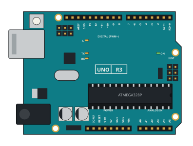

# Arduino Uno R3 — blink + Serial smoke

The Uno R3 smoke example and its onboarding docs pack. The board page is
[`docs/boards/arduino-uno.md`](../../docs/boards/arduino-uno.md).



## What runs

A PlatformIO `uno` sketch prints `uno-ok` over USART0, then blinks
`LED_BUILTIN` (D13, PB5) and prints a dot each loop. The io-smoke asserts the
`uno-ok` line, so a pass means real Arduino-core firmware booted and drove the
UART, not only that the step budget ran out.

| File | What |
|------|------|
| `src/main.cpp` | The sketch |
| `platformio.ini` | `atmelavr` / `uno` / `arduino` |
| `io-smoke.yaml` | CLI smoke against `configs/systems/arduino-uno.yaml` |
| `REQUIRED_DOCS.md` | Vendor documents the model and pinout were read from |
| `EXTERNAL_COMPONENTS.md` | Onboard parts and how the twin treats each |
| `VALIDATION.md` | Runbook and validation record |
| `images/` | Board drawing and pinout (see images/README.md for source and licence) |

For all three I/O ports and the ADC, see
[`examples/arduino-uno-io`](../arduino-uno-io/README.md).

## Run

```bash
cargo run -q -p labwired-cli -- test \
  --script examples/arduino-uno-blinky/io-smoke.yaml \
  --no-uart-stdout
```

## Rebuild the fixture

```bash
pio run -d examples/arduino-uno-blinky
cp examples/arduino-uno-blinky/.pio/build/uno/firmware.elf tests/fixtures/avr/arduino-uno-blinky.elf
cp examples/arduino-uno-blinky/.pio/build/uno/firmware.hex tests/fixtures/avr/arduino-uno-blinky.hex
```

The HEX is the same image for a real board:
`avrdude -c arduino -p m328p -b 115200 -P <port> -U flash:w:tests/fixtures/avr/arduino-uno-blinky.hex`.
